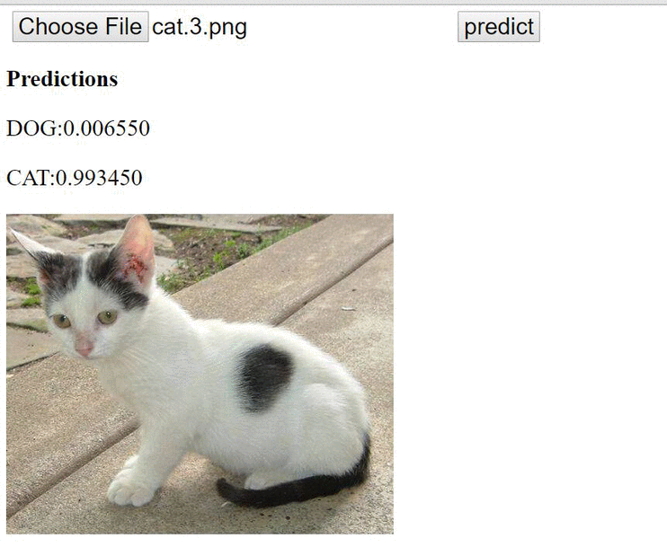
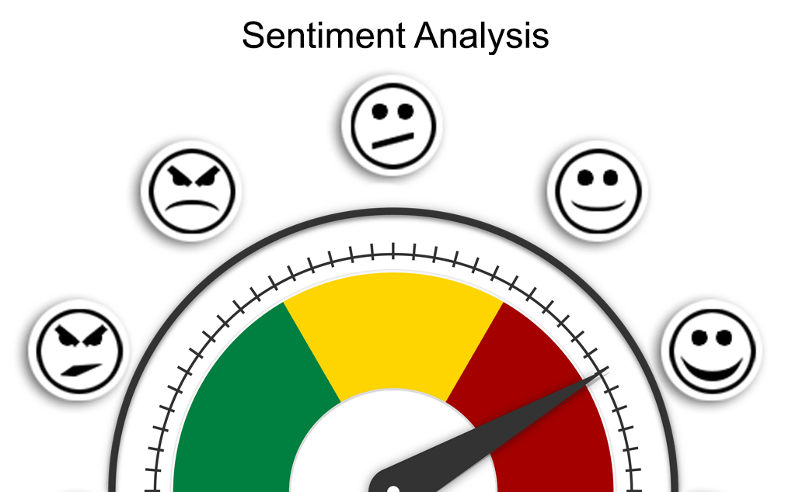
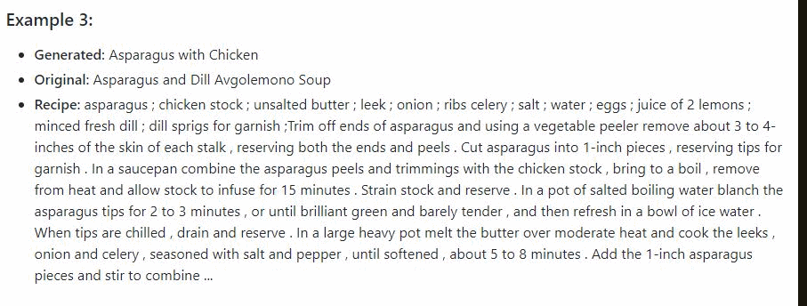
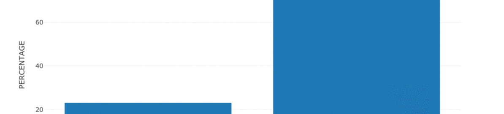
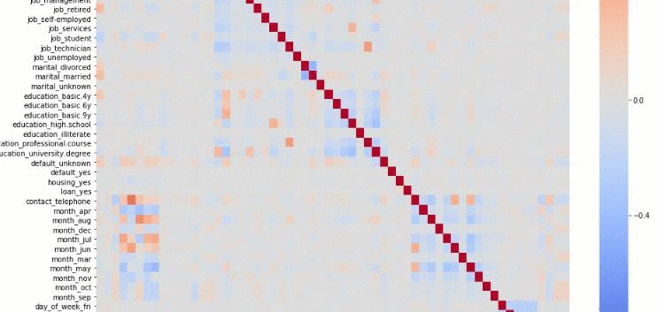

## Data Science Portfolio

### Career Profile
Junior data scientist with 3+ years’ experience, as a data analytics for Educational Service startup company and as a software developer, and research assistant for the research funded by the National Science Foundation, USA.

Core Competencies includes research, design, development, user data analysis, ETL pipeline, Data mining, database design, database management, Statistical analysis, Predictive modeling, Data visualization, and Report writing.

### [Experience](https://github.com/vamshigunji183/Data-Science-portfolio/blob/master/Resume/MasterResume_Vamshi.pdf) 
National Science Foundation
* Software Developer (Currently-01/2018)
Talent Sprint
* Data Analyst (08/2016-04/2015)

#### Technical Skills
* Programming Languages: Python, C++, C#, Swift, Java, C, Shell scripting
* Statistical Analysis: R, MATLAB
* Data Analysis: Pandas, Numpy, Scipy, Scikit-learn
* Data Visualization: Matplotlib, Seaborn, Tableau
* Big Data Frameworks: Hadoop, Spark, Hive, Cassandra, BigQuery
* Deep Learning Frameworks: Tensorflow, Keras, Pytourch, Caffe, Thenos
* Cloud Technologies: Google Cloud Platform (Full Stack), Amazon Web Services

### Projects Gallary
| Computer Vision |Cats and Dog Classifier|  Vehicle Tracking | Advanced Lane Detection|
|------------ | -------------| -------------| -------------|
|Preview|   |vehicle detection |   |

| Natural Language Processing |Neural Machine Translation| New Summarization| Twitter Sentiment Analysis | Recipe Summarization|
|------------ | -------------| -------------| -------------|-------------|
|Preview|   |   |    |   |

| Business Intelligence |Spotify Churn Prediction| Customer Segmentation| Campaign Analysis |
|------------ | -------------| -------------| -------------|
|Preview|   |   |    |

### Project Portfolio

#### [Business Intelligence](https://github.com/vamshigunji183/Data-Science-portfolio/tree/master/Business%20Intelligence)
* [Spotify Users Churn Prediction](https://github.com/vamshigunji183/Data-Science-portfolio/tree/master/Business%20Intelligence/Spotify-User-Churn-Prediction)
* [Customer Segementation](https://github.com/vamshigunji183/Data-Science-portfolio/tree/master/Business%20Intelligence/Identification-Customer-Segment)
* [Bank ad Marketing Campaign Analysis](https://github.com/vamshigunji183/Data-Science-portfolio/tree/master/Business%20Intelligence/Bank-Marketing-Campaign-Analysis)
* [Santandar Customer Transaction Prediction (Kaggle Competition)]()

#### [Natural Language processing](https://github.com/vamshigunji183/Data-Science-portfolio/tree/master/Natural%20Language%20Processing)
* [NEWS recommendations App](https://github.com/vamshigunji183/NLP-Portfolio/tree/master/NEWS%20Recommendation)
* [NEWS Summarization App](https://github.com/vamshigunji183/NLP-Portfolio/tree/master/NEWS-Summarization-App)
* [Recipe Summarization App](https://github.com/vamshigunji183/Recipe-Summarizer)
* [Twitter Sentiment Analysis](https://github.com/vamshigunji183/Sentiment-Analysis-Twitter)
* [Neural Machine Translation (EN-DE, EN-FN)](https://github.com/vamshigunji183/Neural-Machine-Translation)

#### [Computer Vision](https://github.com/vamshigunji183/Data-Science-portfolio/tree/master/Computer%20Vision)
* [Cats and Dogs Classifier Web App](https://github.com/vamshigunji183/DL_webapp)
* [Self-Driving car Vision Project]()
  * [Lane Detection](https://github.com/vamshigunji183/LaneDetection)
  * [Advanced Lane Detection](https://github.com/vamshigunji183/Advance-lane-detection)
  * [Vehicle Tracking ](https://github.com/vamshigunji183/Vehicle_detection)
  * [Traffic signal Detection](https://github.com/vamshigunji183/Tracffic-SIgnal-Classification-ConvNet)

#### [Certifications](https://github.com/vamshigunji183/Data-Science-portfolio/tree/master/Certifications)
* [Stanford University- Database](https://github.com/vamshigunji183/Data-Science-portfolio/blob/master/Certifications/Vamshi_Stanford_Certificates_DataBase.pdf)
* [University of Michigan- Applied Data Science](https://github.com/vamshigunji183/Data-Science-portfolio/blob/master/Certifications/Vamshi_UoM_Certificates_Applied%20Data%20Science.pdf)
